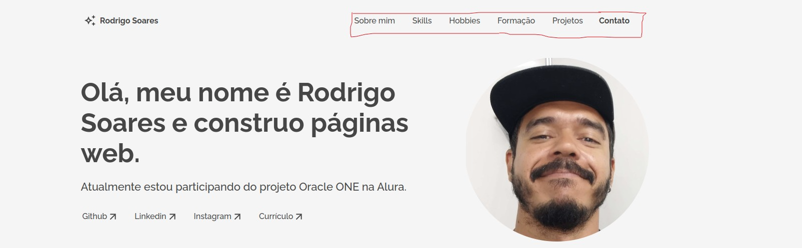
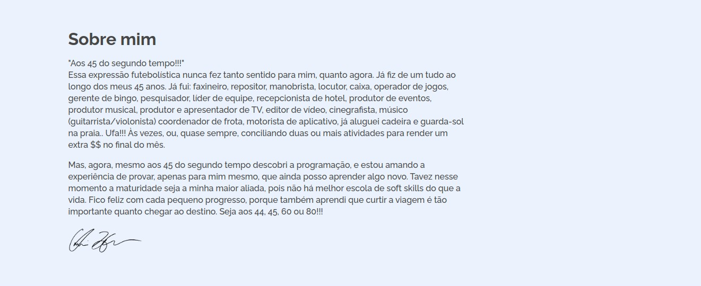

# Challenge Alura | Portfólio

> Este desafio Alura propôs a criação de um portfólio, com a ideia de que pudéssemos documentar um pouco do que aprendemos ao longo do curso e também contar um pouco sobre nós.  Esta versão está disponível apenas em formato desktop. 
 

  

## Portfólio - Navegação

Logo no cabeçalho, há um menu de navegação que leva direto às demais seções da página.

  

## Portfólio - Links para redes sociais

Na área de apresentação contém alguns links que direcionam para as redes sociais.

  

## Portfólio - Link para currículo

Há também um link específico que ao ser clicado baixa o currículo em formato pdf. Para exemplificar, deixei apenas a reprodução da página em formato pdf.

  

## Portfólio - Sobre mim

Na seção "Sobre mim", um pequeno resumo da minha trajetória pessoal e profissional.

  

## Portfólio - Skills e Hobbies

Na parte "Skills e Hobbies", você fica sabendo sobre as tecnologias que estou usando e também o que costumo fazer nos momentos de lazer.

  

## Portfólio - Formação/Cursos

Nesta seção, apresento os cursos que estou fazendo no momento. Um deles, na **Alura** com a parceria da **Oracle**, chamado "ONE" que significa **Oracle Next Education**, para formação front-end, iniciado em abril de 2022; e o outro é para formação fullstack no **Dev Club**, iniciado em janeiro de 2022. 

  

## Portfólio - Experiência Profissional

Como ainda não possuo experiência no mercado de trabalho, apresentei aqui dois projetos que fiz neste curso da Alura. Ambos possuem links para acesso do repositório e da aplicação.

  

## Portfólio - Formulário de Contato

Na última seção, há um formulário de contato. Preenchendo as informações nome, email e assunto, o botão "Enviar Mensagem" ficará habilitado para interação.

